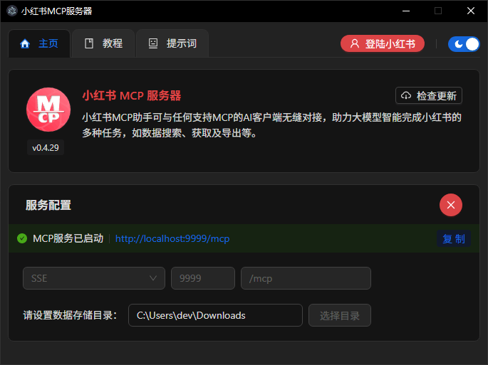

# 小红书MCP服务器 | xhs-mcp-server
> 基于Electron + 小红书Web API的极速开发利器 🚀



## 特性1： 极速启动 - 比泡面还快！
还在为搭建开发环境发愁？Node.js、UV、Python...这些统统say goodbye！
我们的安装流程简单到连你家猫都能搞定：
1. 📥 下载安装（比点外卖还简单）
2. ⚡ 运行启动（比微波炉热饭还快）
3. 📋 复制粘贴（比Ctrl+C/V还顺手）

## 特性2： API闪电战 - 让龟速工具无地自容！
那些需要模拟点击的"老古董"工具可以退休了！
我们提供的是纯血统API服务，专治各种低效：
- ⚡ 光速采集：1秒百篇笔记，快到让你怀疑人生
- 🔍 数据全裸出镜：连页面抓取都看不到的隐藏数据，我们统统给你
- 📊 智能整理：自动筛选+导出，让你的数据分析师感动到哭


👉 立即体验小红书开发的新姿势：
https://xhs-mcp.aicu.icu

（温馨提示：使用后可能会对其他工具产生嫌弃心理，属正常现象）

[免责声明] 本工具威力很大很强悍，请低调使用知道吗宝贝 💇‍♂️

---
# ✨✨✨✨✨✨✨✨✨✨✨✨✨
---

> 上述介绍采用AI自动生成    
> 下边，请开始作者的吹嘘

## 🤔 为什么开源
技术共享，造福人类

## 👍 相比其他工具
1. 无需安装Node.js、Python等环境
2. 一键安装、启动、运行、配置，上手直用
3. 采用接口，数据精准，速度飞快！
4. 支持超多工具，真的超多超实用！

## 👉 关注我们


# 开发者必看
> 代码仅供学习参考，可本地二次开发自己使用，不得打包分发用作商业用途！    
> 代码未做重构优化。懒    

## 安装开发环境
```bash
$ npm i
```

## 运行
```bash
$ npm run build:mcp
$ npm run dev
```