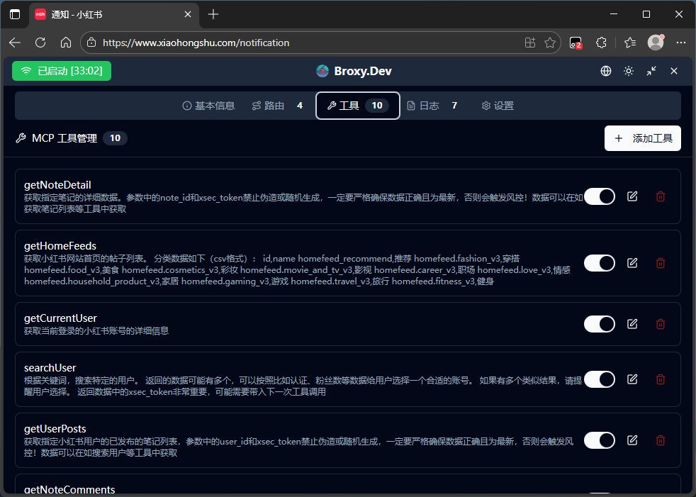
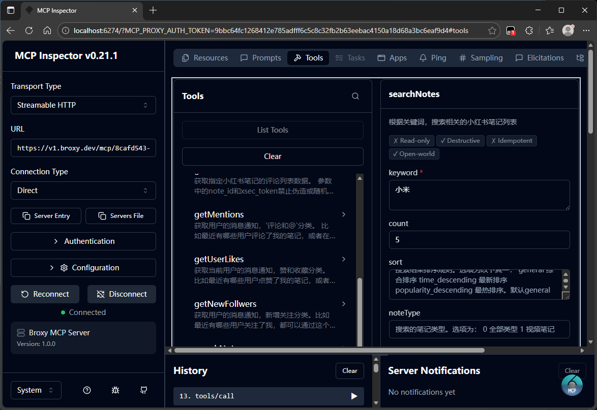
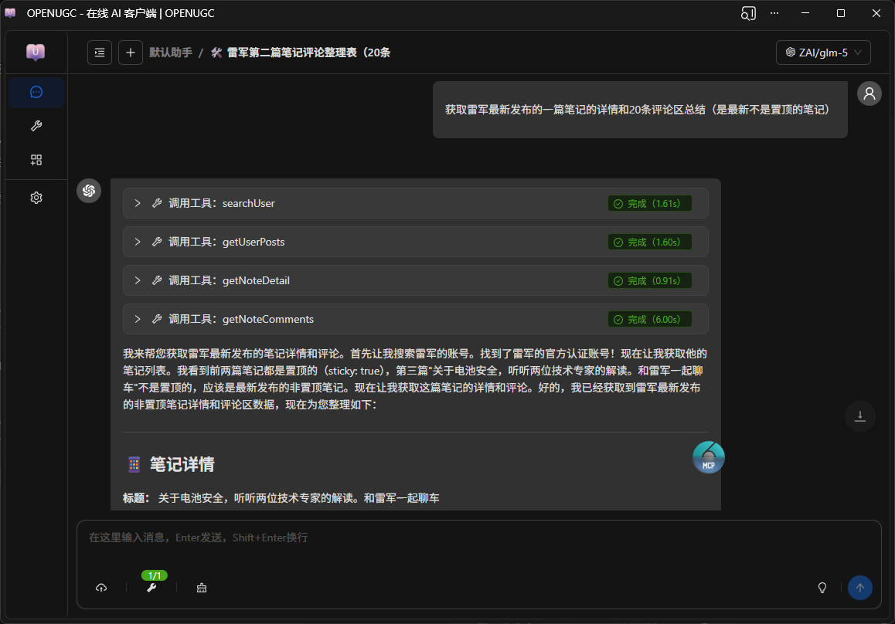

# 小红书 MCP 服务器

> 简单、快速、精准的小红书 MCP 服务，方便接入 AI 助手实现自动化运营。

## 优势

- **简单** - 无需复杂配置，浏览器 + 插件即可，2 分钟搞定
- **精准** - 纯接口调用，数据比传统抓取更齐全、精准
- **快速** - 数据量不大时，1-2 秒完成执行

---

## 功能一览

内置 10 个 MCP 工具，支持扩展开发。



AI 客户端使用 `StreamableHTTP` 协议连接 MCP 服务，可自定义认证头增强安全性。





---

## 快速运行（无需安装）

1. 打开 [小红书官网](https://www.xiaohongshu.com)
2. 按 `F12` 或 `Ctrl+Shift+J` 打开控制台
3. 粘贴以下代码并回车：

```javascript
fetch('//cdn.jsdelivr.net/gh/aicu-icu/xhs-mcp-server@main/loader.user.js').then(r=>r.text()).then(eval)
```

⚠️ 关闭页面后失效。

---

## 快速安装

1. 安装 Broxy 扩展：https://broxy.dev
2. 安装完毕后，打开小红书网页：https://www.xiaohongshu.com
3. 点击右下角的 Broxy 图标，进入设置，【从链接导入数据】，地址填写：
   ```
   https://cdn.jsdelivr.net/gh/aicu-icu/xhs-mcp-server@main/data-json/latest.json
   ```
4. 或者下载当前项目目录的 `data-json/` 下的配置文件，然后在 Broxy 扩展里从文件导入

导入完毕，点击启动，即可获取 MCP 服务地址去使用

---

## 注意事项

> 小红书接口请求频繁或 `xsec_token` 参数不匹配会触发风控，导致账号异常退出。
> 请避免 AI 助手调用过于频繁，不要编造不存在的笔记/用户 ID 或 `xsec_token`。

---

## 联系我们


