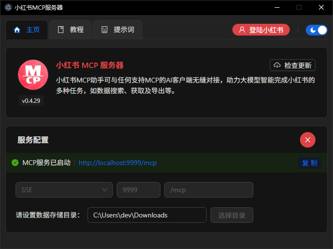

# 小红书MCP服务器 | xhs-mcp-server
> 基于Electron + 小红书Web API的极速开发利器 🚀    
> [https://xhs-mcp.aicu.icu](https://xhs-mcp.aicu.icu)

**小红书MCP服务器 - 专业数据获取与分析工具 | 智能运营决策助手**

**🔍 精准数据驱动小红书运营**
小红书MCP服务器是一款专为**数据化运营**设计的AI辅助工具，通过智能连接小红书平台，帮助用户**高效获取、深度分析、系统管理**笔记与用户数据。无论是个人博主、品牌方还是MCN机构，都能通过数据洞察优化运营策略，提升账号表现！

**📊 核心功能**
✅ **笔记数据获取**
- 批量抓取小红书笔记的**阅读量、点赞、收藏、评论**等核心指标
- 支持按关键词、话题、时间范围筛选数据，精准定位目标内容

✅ **用户行为分析**
- 监测粉丝互动趋势，分析活跃时段、兴趣偏好
- 竞品账号对比，挖掘高增长笔记的共性特征

✅ **评论管理与洞察**
- 自动整理笔记评论，提取高频关键词与情感倾向
- 识别高价值用户，助力精准互动与粉丝维护

✅ **数据导出与可视化**
- 一键生成Excel/CSV报表，支持自定义数据字段
- 可视化看板（折线图、柱状图等），直观呈现运营趋势

**⚙️ 技术优势**
- **稳定高效**：7×24小时运行，支持大规模数据抓取
- **智能解析**：AI辅助清洗与结构化数据，提升分析效率
- **安全合规**：采用合法接口，保障数据获取稳定性

**🎯 适用场景**
✔ **个人博主**：分析爆款笔记规律，优化内容方向
✔ **品牌运营**：追踪产品声量，评估营销活动效果
✔ **数据研究**：行业趋势分析，挖掘用户真实需求

**#小红书数据分析 #运营工具 #用户行为分析 #数据抓取 #竞品监测**

## 特性1： 极速启动 - 比泡面还快！
还在为搭建开发环境发愁？Node.js、UV、Python...这些统统say goodbye！
我们的安装流程简单到连你家猫都能搞定：
1. 📥 下载安装（比点外卖还简单）
2. ⚡ 运行启动（比微波炉热饭还快）
3. 📋 复制粘贴（比Ctrl+C/V还顺手）

## 特性2： API闪电战 - 让龟速工具无地自容！
那些需要模拟点击的"老古董"工具可以退休了！
我们提供的是纯血统API服务，专治各种低效：
- ⚡ 光速采集：1秒百篇笔记，快到让你怀疑人生
- 🔍 数据全裸出镜：连页面抓取都看不到的隐藏数据，我们统统给你
- 📊 智能整理：自动筛选+导出，让你的数据分析师感动到哭

👉 立即体验小红书开发的新姿势：
https://xhs-mcp.aicu.icu

（温馨提示：使用后可能会对其他工具产生嫌弃心理，属正常现象）

[免责声明] 本工具威力很大很强悍，请低调使用知道吗宝贝 💇‍♂️
